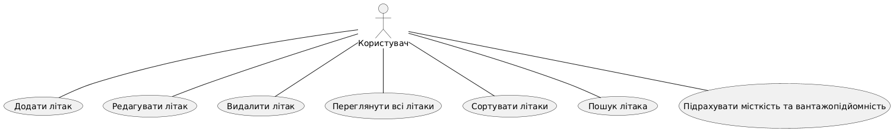
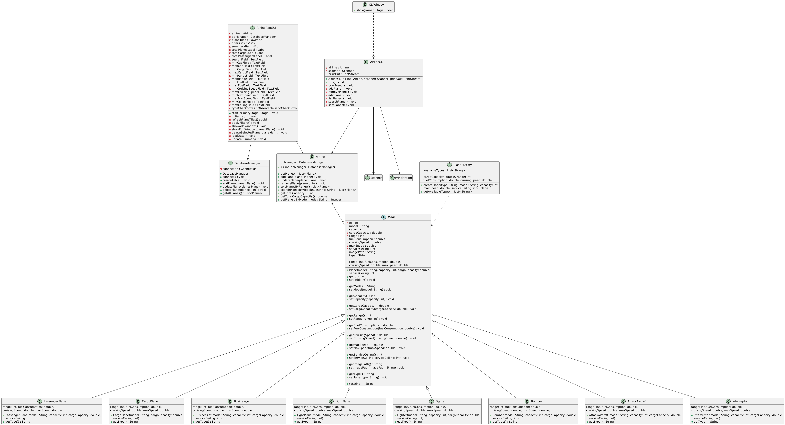
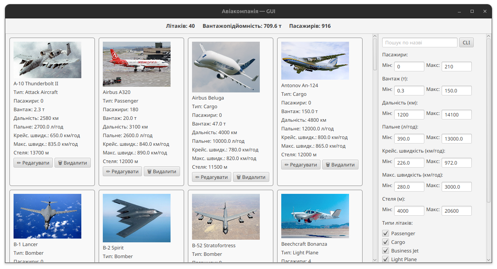
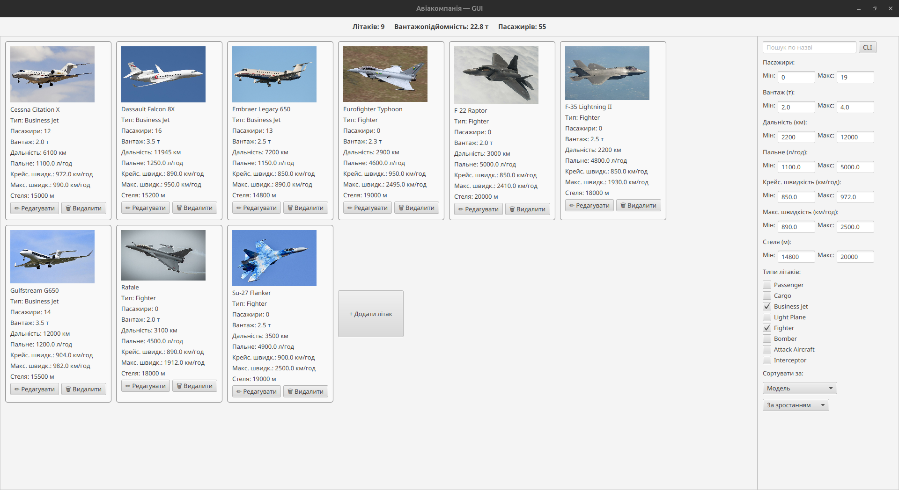
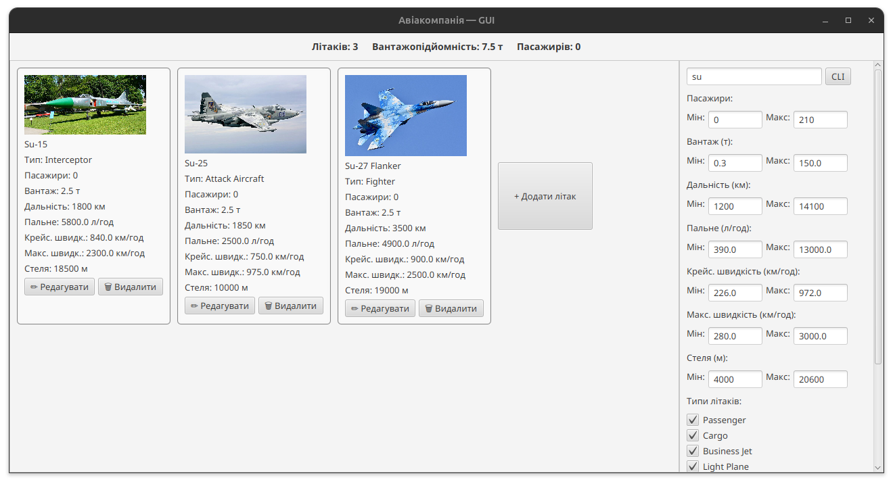
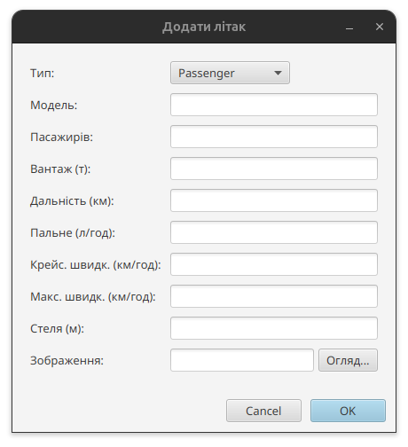
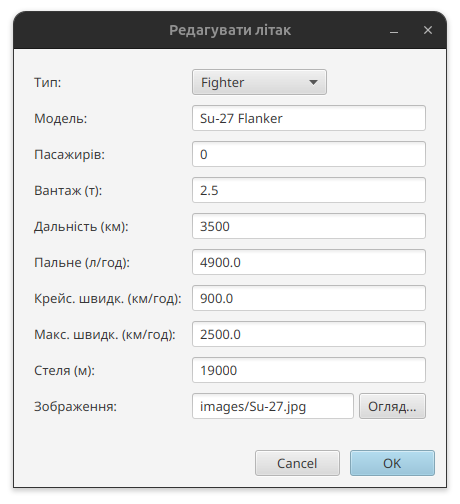
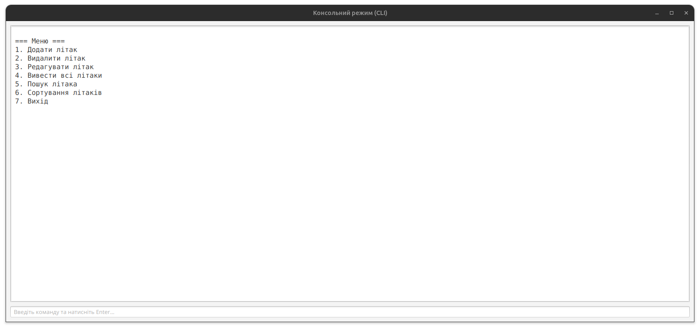
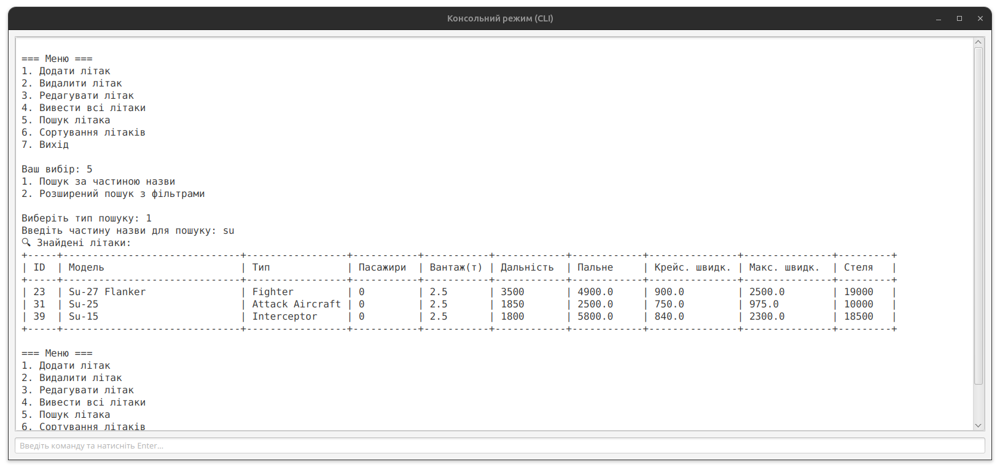

# АВІАКОМПАНІЯ – КУРСОВИЙ ПРОЄКТ НА JAVA

Завдання до курсової роботи:
9. Авіакомпанія. Визначити ієрархію літаків. Створити авіакомпанію. Підрахувати  загальну місткість і вантажопідйомність. Здійснити сортування літаків компанії за дальністю польоту. Знайти літак у компанії, що відповідає заданому діапазону параметрів споживання пального.
## ТЕХНОЛОГІЇ

- Java 17
- JavaFX
- SQLite

## Структура проєкту
```
src/
├── airline - класи літаків
│   ├── Airline.java – клас для управління колекцією літаків
│   ├── AttackAircraft.java - штурмовик
│   ├── Bomber.java - бомбардувальник
│   ├── BusinessJet.java - бізнес-джет
│   ├── CargoPlane.java – вантажний літак
│   ├── Fighter.java - винищувач
│   ├── Interceptor.java - перехоплювач
│   ├── LightPlane.java - легкий літак
│   ├── PassengerPlane.java - пасажирський літак
│   ├── Plane.java - абстрактний базовий клас для літаків
│   └── util
│       └── PlaneFactory.java – фабрика для створення літаків
├── db
│   └── DatabaseManager.java – клас відповідальний за взаємодію з БД
├── Main.java – вхід в програму
└── ui
    ├── AirlineAppGUI.java – графічний інтерфейс
    ├── AirlineCLI.java – консольний інтерфейс
    └── CLIWindow.java – консольний інтерфейс в графічному вікні

```
## Модель даних (таблиця planes)
```
cid|name            |type   |notnull|dflt_value|pk|
---+----------------+-------+-------+----------+--+
  0|id              |INTEGER|      0|          | 1|
  1|type            |TEXT   |      1|          | 0|
  2|model           |TEXT   |      1|          | 0|
  3|capacity        |INTEGER|      1|          | 0|
  4|cargo_capacity  |REAL   |      1|          | 0|
  5|range_km        |INTEGER|      1|          | 0|
  6|fuel_consumption|REAL   |      1|          | 0|
  7|cruising_speed  |REAL   |      1|          | 0|
  8|max_speed       |REAL   |      1|          | 0|
  9|service_ceiling |INTEGER|      1|          | 0|
 10|image_path      |TEXT   |      0|          | 0|
```
---
## Use case діаграма


## Class діагарама


---
## ПРИКЛАДИ ІНТЕРФЕЙСУ

### Головний екран без фільтрів


### головний екран з фільтрами


### Пошук за моделлю літака


### Вікно додавання літака


### Вікно редагування літака


### Перегляд зображення літака у великому розмірі


### Консольний режим (CLI) — стартове меню


### Консольний режим — пошук літака


---

## [Презентація в форматі pdf](./preview/presentation.pdf)

---

## ЛІЦЕНЗІЯ

Проект доступний за ліцензією MIT.