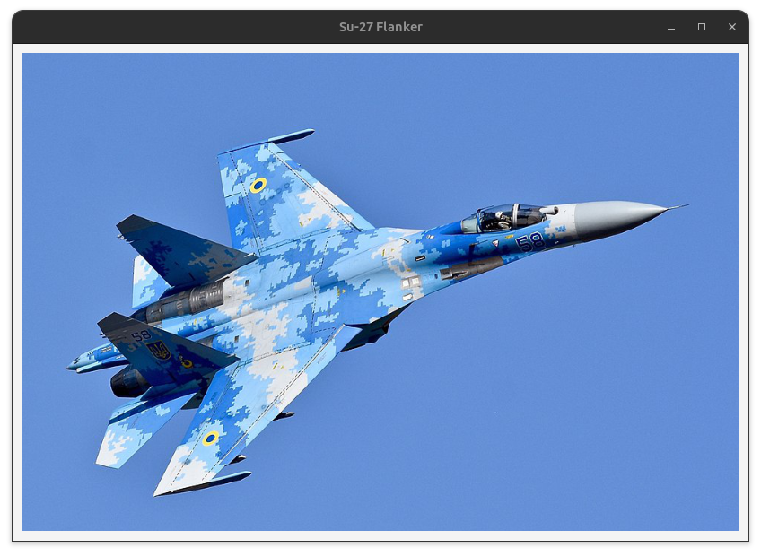
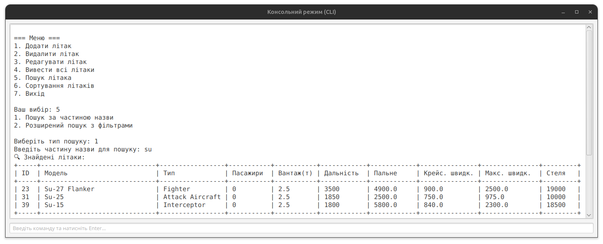

# АВІАКОМПАНІЯ – КУРСОВИЙ ПРОЄКТ НА JAVA

Ця курсова робота реалізує настільний Java-додаток "авіакомпанія" з використанням графічного інтерфейсу та бази даних SQLite. Програма дозволяє працювати зі списком літаків, сортувати їх за дальністю польоту, а також здійснювати пошук за назвою і параметрами.

## ТЕХНОЛОГІЇ

- Java 17
- JavaFX
- SQLite

## ЛІЦЕНЗІЯ

Проект доступний за ліцензією MIT.

---

## ПРИКЛАДИ ІНТЕРФЕЙСУ

### Головний екран без фільтрів

### головний екран з фільтрами

### Пошук за моделлю літака

### Вікно додавання літака

### Вікно редагування літака

### Перегляд зображення літака у великому розмірі

### Консольний режим (CLI) — стартове меню

### Консольний режим — пошук літака

---

## Опис

- **Головний екран**: Відображає всі літаки, статистику, фільтри та панель керування.
- **Панель фільтрів**: Дозволяє обирати типи літаків та задавати діапазони параметрів для фільтрації.
- **Пошук**: Швидкий пошук за назвою/моделлю.
- **Додавання/редагування літака**: Вікна для внесення даних про новий або існуючий літак.
- **Перегляд зображення**: Відкриття фото літака у збільшеному розмірі.
- **CLI**: Вбудований консольний режим з усіма основними функціями — для тих, хто звик до роботи з текстовим інтерфейсом.

